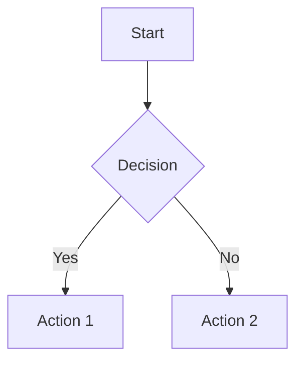
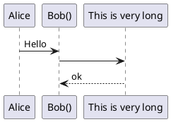
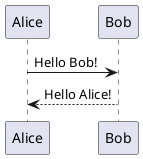

示例一[^1]，示例二[^note]。示例三[^demo]，示例四[^demo2].示例五[^demo3]

[^1]: 第一个注脚。
[^note]: 第二个注脚。

[^demo]: 第三个注脚,跳id[5.1](#custom-anchor)
[^demo2]: 第四个注脚，跳链接 [官网](https://gitcode.com)。
[^demo3]: 第五个注脚,跳H1[5.1](#5.1复用MindSpeed训练优化)


# 5.1复用MindSpeed训练优化

-----------------

[gitcode能跳- GitHub能跳-案例一](#custom-anchor)

[gitcode跳不了-GitHub能跳-案例二](#unique-id)

[gitcode跳不了-GitHub能跳-案例三，两个杠](#案例三和四func-getkvstoretstring-kvoptions-where-t--singlekvstore)

[gitcode能跳-GitHub跳不了-案例四，一个杠](#案例三和四func-getkvstoretstring-kvoptions-where-t-singlekvstore)

<a id="custom-anchor"></a>
## 案例一：id-custom-anchor

<h2 id="unique-id">案例二：id-unique-id</h2>

### 案例三和四func getKVStore\<T>(String, KVOptions) where T \<: SingleKVStore


------------
---分割线---------


[案例三](./README1111.md#--singlekvstore)

[111111](./README1111.md#--singlekvstore)


# --singlekvstore



```Alice -> "Bob()" : Hello
"Bob()" -> "This is very long" as Long
' You can also declare:
' "Bob()" -> Long as "This is very long"
Long --> "Bob()" : ok
```
[^1]: 此处使能的特性包含本文[5.1](## 案例一：id-custom-anchor)




Alice -> "Bob()" : Hello
"Bob()" -> "This is very long" as Long
' You can also declare:
' "Bob()" -> Long as "This is very long"
Long --> "Bob()" : ok





2343242342343213123123
123123234234234324241231231
12321312
www.baidu.com

这是一句在 `` 符号里面的话：`就是这句话`对吧 `对吧`323333323iuyiuhi
这是一句在 `` 符号里面的话：`就是这句话`对吧`对吧`
# 这是一个标题，每个分支都有，随便改234` 2 `3432666666623423423423424wefwefwe66`2342346`66666661`66`66wfwefew3242wefwefwef34234234234safsafsadf23423424
这是一条只有mian分支才有的专属文案，别改123123213
这是一条只有main分支才有的专属文案，可1`以`改we2342424242424fewfwefewfwefwefw12312313efwe3242234242434234fwefwef234234234wqwerqwrefwe
这是一条所有分支都相同的文案A-别改
这是一条所有分支都相同的文案B-别改
这是一条所有分支都相同的文案C-别改
234234234
123123123
## wfwe_def
# www.baidu.com、www.gitcode.com
# www.baidu.com、
# 、www.baidu.com
# www.baid、u.com

https://www.dededededededede

PR的检视意见评论同步到commit里面123
PR的检视意见评论同步到commit里面123
PR的检视意见评论同步到commit里面123
PR的检视意见评论同步到commit里面123234
PR的检视意见评论同步到commit里面123
PR的检视意见评论同步到commit里面234
PR的检视意见评论同步到commit里面234

这是第二个commit了
这是第二个commit了
这是第二个commit了
这是第二个commit了
这是第二个commit了


